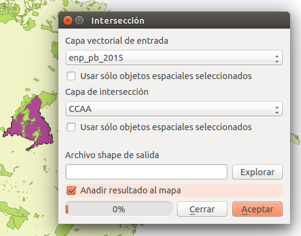

# Análisis Vectorial I

En este curso de *Introducción a QGIS* únicamente se explicará las herramientas de análisis
de uno de los tipos de datos geoespaciales: **los archivos o datos vectoriales**. QGIS tiene en 
su barra de herramientas una pestaña dedicada a este grupo de procedimientos: "Vectorial". Dentro 
de ella encontraremos las siguientes opciones:

* OpenStreetMap
* Herramientas de Análisis
* Herramientas de Investigación
* Herramientas de Geoproceso
* Herramientas de Geometría
* Herramientas de Gestión de Datos

Debido al enfoque introductorio de este curso, de estas seis aplicaciones solo se tratarán 
cuatro de ellas: `análisis`, `investigación`, `geoproceso` y `geometría`. 

## Herramientas de Análisis

Esta caja de herramientas nos permite realizar operaciones básicas de análisis como 
contar puntos o calcular la longitud de líneas en una capa base de polígonos.

### Puntos en Polígonos

Esta opción nos permite calcular la suma (u otra operación aritmética) de puntos que
se encuentran sobre una capa poligonal. Esta operación se puede realizar sobre la totalidad
de la superficie de la capa o de manera segmentada. Es decir, calcular el subconjunto de
puntos que existen sobre cada uno de los *features* o partes que componen la capa poligonal.
Una vez en la ventana debemos seleccionar la capa poligonal, la capa de puntos, los campos
de esta última a añadir (opcional), la operación (en nuestro caso *suma*) y el nombre del
nuevo campo donde aparecerá el resultado. Por último nombraremos el archivo de salida.

Es recomendable comprobar que la operación se ha realizado correctamente. Si las dos capas
no compartían la misma proyección no obtendremos resultado alguno (QGIS nos avisa con antelación).

### Sumar Longitud de Líneas

Esta herramienta nos permite calcular la longitud de una capa de líneas que se encuentran sobre una capa poligonal. Muy similar a la opción anterior, esta operación se puede realizar sobre la totalidad de la superficie de la capa o de manera segmentada. Una vez en la ventana debemos seleccionar la capa poligonal, la capa de líneas y el nombre del nuevo campo donde aparecerá el resultado. Por último nombraremos el archivo de salida.

Una vez más es recomendable comprobar que el proceso ha corrido como es debido. Por ejemplo, se 
puede verificar que en los polígonos donde no pasa línea alguna, el campo es 0. Por otro lado, en
las *features* donde si que pase una línea podemos utilizar la herramienta `Medir Línea` para
medir aproximadamente el tramo.

## Herramientas de Geoproceso

El geoprocesamiento es una de las operaciones más útiles que presenta un software GIS. QGIS 
presenta una selección de las más potentes, además otras tantas pueden ser añadidas a través
de *plugins*. Entre ellas hemos destacado las operaciones de `intersección`, `buffer`, `diferencia`
y `corte`.

### Intersección

A partir del mecanismo de intersección, el usuario puede cruzar dos capas y obtener una nueva con la combinación deseada de *atributos* y configuración espacial. En nuestro caso queremos obtener de la capa de espacios protegidos (`capa de entrada`) únicamente aquellos que interseccionen con la capa de la Comunidad de Madrid (`capa de intersección`).

De igual manera sucede en el caso de los ríos.

Como resultado obtendremos dos capas nuevas, una de espacios protegidos y otra de ríos, ambas limitadas a la Comunidad de Madrid.

### Buffer

### Diferencia

### Corte

**Bonus** Post recomendado: [*Las 10 herramientas de Geoprocesamiento fundamentales en GIS*](http://mappinggis.com/2014/10/herramientas-de-geoprocesamiento-en-gis/).
